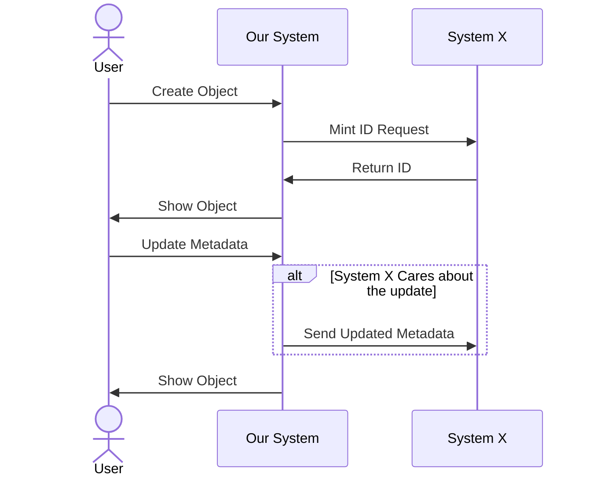

* A User created a new object: I need to mint a ID with ID System X
* A User updates the metadata on the Object: Update Sytem X if the change is something X is interested

**We are updating the people to display as actors**

