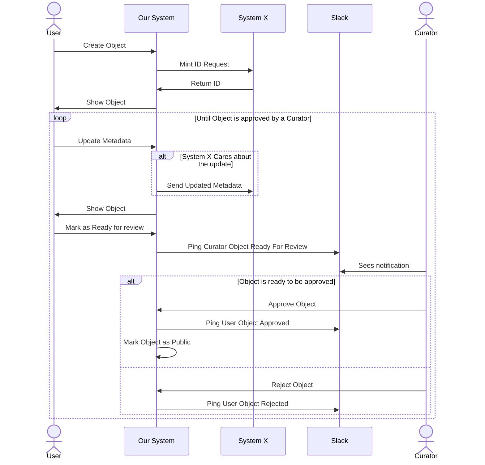

```mermaid
sequenceDiagram
actor u as User
participant os as Our System
participant x as System X
participant s as Slack
actor c as Curator
u->>os: Create Object
os->>x: Mint ID Request
x->>os: Return ID
os->>u: Show Object
loop Until Object is approved by a Curator
  u->>os: Update Metadata
  alt System X Cares about the update
    os->>x: Send Updated Metadata
  end
  os->>u: Show Object
  u->>os: Mark as Ready for review
  os->>s: Ping Curator Object Ready For Review
  c->>s: Sees notification
  alt Object is ready to be approved
    c->>os: Approve Object
    os->>s: Ping User Object Approved
    os->>os: Mark Object as Public
  else
    c->>os: Reject Object
    os->>s: Ping User Object Rejected
  end
end 
```
