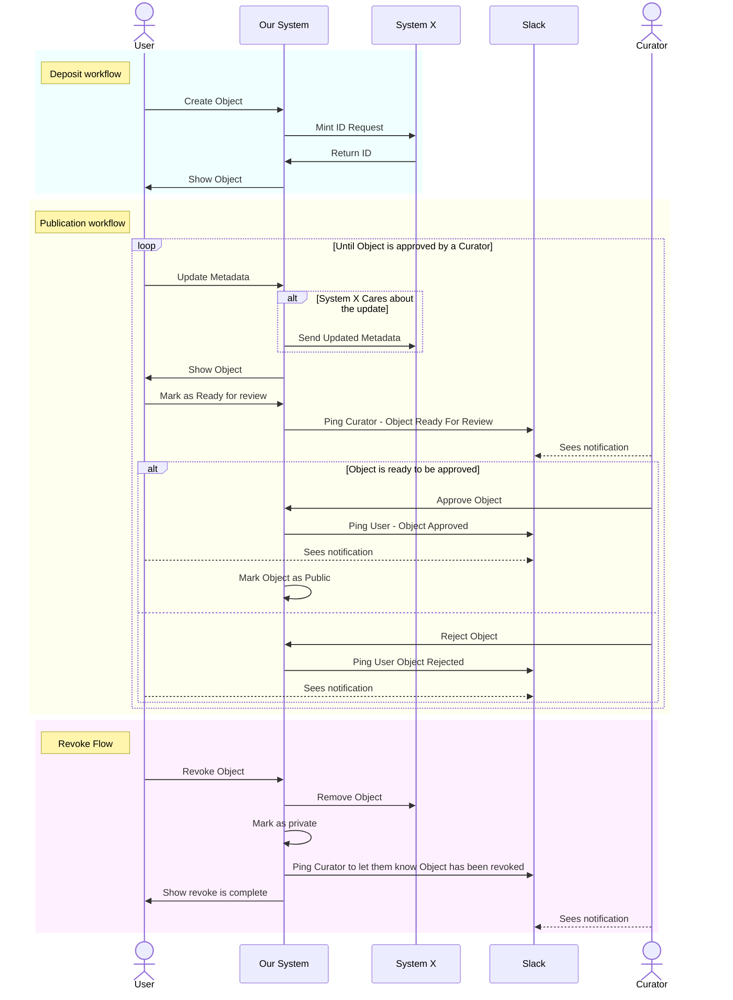

```mermaid

sequenceDiagram
actor u as User 
participant os as Our System
participant x as System X
participant s as Slack
actor c as Curator
rect rgb(240, 255, 255)
note left of u: Deposit workflow
u->>os: Create Object
os->>x: Mint ID Request
x->>os: Return ID
os->>u: Show Object
end
rect rgb(255, 255, 240)
note left of u: Publication workflow

loop Until Object is approved by a Curator
  u->>os: Update Metadata
  alt System X Cares about the update
    os->>x: Send Updated Metadata
  end
  os->>u: Show Object
  u->>os: Mark as Ready for review
  os->>s: Ping Curator - Object Ready For Review
  c-->>s: Sees notification
  alt Object is ready to be approved
    c->>os: Approve Object
    os->>s: Ping User - Object Approved
    u-->>s: Sees notification
    os->>os: Mark Object as Public
  else
    c->>os: Reject Object
    os->>s: Ping User Object Rejected
    u-->>s: Sees notification
  end
end
end 
rect rgb(255, 240, 255)
  note left of u: Revoke Flow
  u->>os: Revoke Object
  os->>x: Remove Object
  os->>os: Mark as private
  os->>s: Ping Curator to let them know Object has been revoked
  os->>u: Show revoke is complete
  c-->>s: Sees notification
end
```
