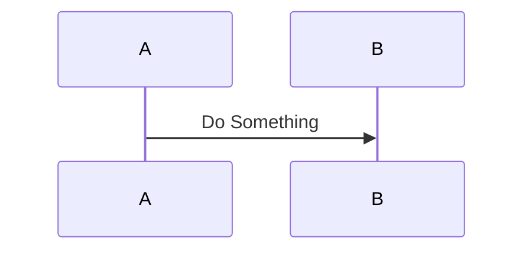

Mermaid System Scenario
You are designing a system that needs to:

* A User created a new object: I need to mint a ID with ID System X
* A User updates the metadata on the Object: Update Sytem X if the change is something X is interested
* The system notifies curator when an object is ready for review
* A Curator needs to approve the object for it to show up publically in the system
* A User can revoke an object at any time: Need to revoke System X ID



## Cheet Sheet

Here is a cheet sheet of useful items for a mermaid flow diagram.  Full documentation can be found at [Mermaid.js](https://mermaid-js.github.io/mermaid/#/sequenceDiagram)

### participants
  actor <name>: <display>
  
  participant <name>: <display>

  
  ```mermaid
  sequenceDiagram
    actor you as You
    participant store as Pet store
  ```

### Alternate
 alt < choice >
    ...
 else
    ...
 end

  ```mermaid
  sequenceDiagram
    actor you as You
    participant store as Pet store
    alt you love cats?
      you->>store: Buy a cat
    else you love fish
      you->>store: Buy a fish
    else you do not want a pet
      you->>you: stay home
    end  
  ```

### Loop
 loop < until when>
   ...
 end

  ```mermaid
  sequenceDiagram
      loop until you are full
        spoon->>mouth: Insert food on spoon
      end
  ```

### Theming
  Theming Mermaid can be done in a variety of ways.  See full documentation at [Mermaid.js](https://mermaid-js.github.io/mermaid/#/theming)
1. Rectangles
   * rect rgb(240, 255, 255)
   * rect rgb(255, 240, 255)
   * rect rgb(255, 255, 240)
1. Notes
   * note <left/right> of <the particiapnt>: <note>
3. Overall 
  ```
  %%{init: { 'theme': 'forest',
             'sequence': {'useMaxWidth':false, 
                          'mirrorActors':false,   
                          'diagramMarginX': 10
                          } 
            } 
  }%%
  ```

