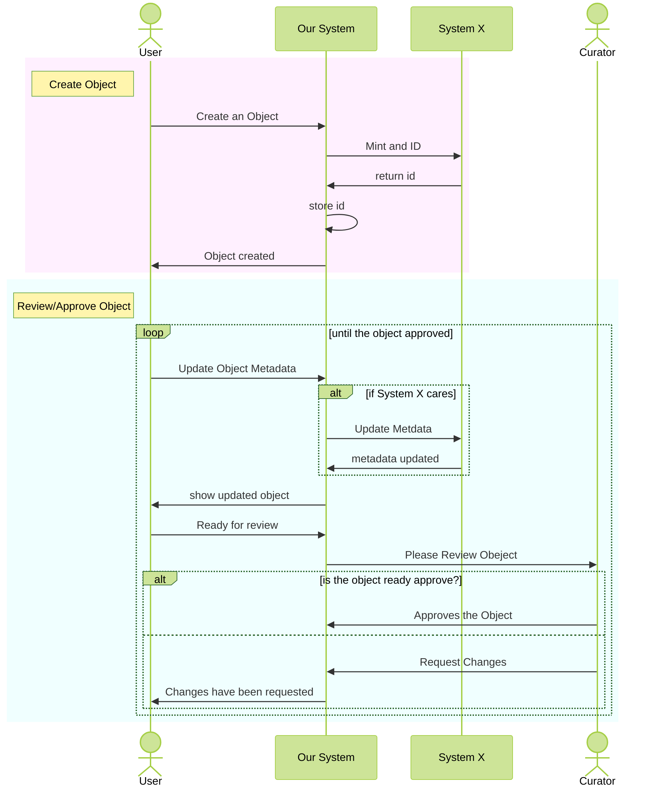

Mermaid System Scenario
You are designing a system that needs to:

* A User created a new object: I need to mint a ID with ID System X
* A User updates the metadata on the Object: Update Sytem X if the change is something X is interested
* The system notifies curator when an object is ready for review
* A Curator needs to approve the object for it to show up publically in the system
* A User can revoke an object at any time: Need to revoke System X ID



## Theming
1. Rectangles
   * rect rgb(240, 255, 255)
   * rect rgb(255, 240, 255)
   * rect rgb(255, 255, 240)

1. Overall 
  ```
  %%{init: { 'theme': 'forest',
             'sequence': {'useMaxWidth':false, 
                          'mirrorActors':false,   
                          'diagramMarginX': 10
                          } 
            } 
  }%%
  ```

