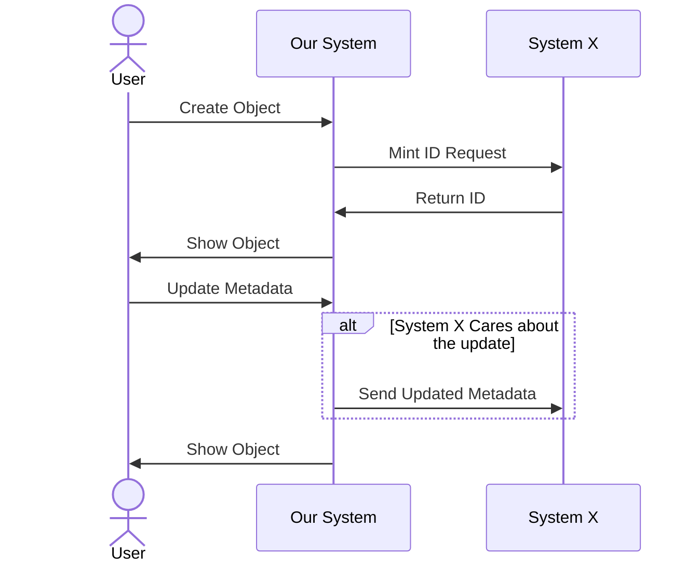

```mermaid
sequenceDiagram
actor u as User
participant os as Our System
participant x as System X
u->>os: Create Object
os->>x: Mint ID Request
x->>os: Return ID
os->>u: Show Object
u->>os: Update Metadata
alt System X Cares about the update
  os->>x: Send Updated Metadata
end
os->>u: Show Object
```
