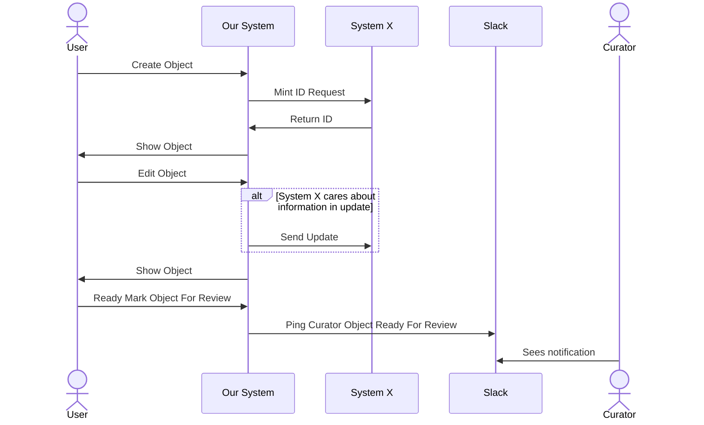

```mermaid
sequenceDiagram
actor User
participant Our System
participant System X
participant Slack
actor Curator
User->>Our System: Create Object
Our System->>System X: Mint ID Request
System X->>Our System: Return ID
Our System->>User: Show Object
User->>Our System: Edit Object
alt System X cares about information in update
  Our System->>System X: Send Update
end
Our System->>User: Show Object
User->>Our System: Ready Mark Object For Review
Our System->>Slack: Ping Curator Object Ready For Review
Curator->>Slack: Sees notification
```
